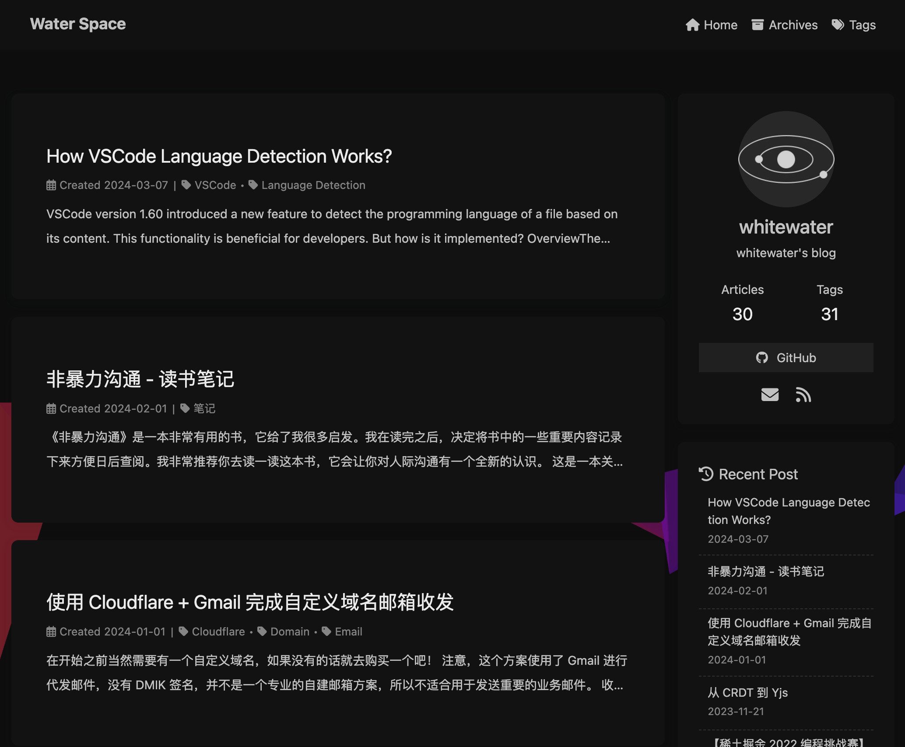
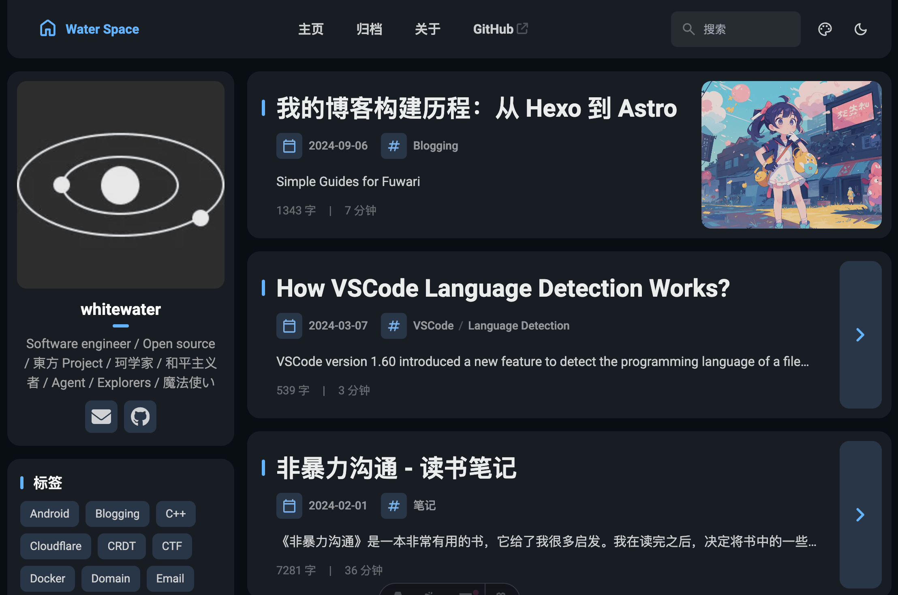

> 这张封面 🍥Fuwari 主题自带的用法示例，为了参考，我选择将其保留
>
> Cover image source: [Source](<https://image.civitai.com/xG1nkqKTMzGDvpLrqFT7WA/208fc754-890d-4adb-9753-2c963332675d/width=2048/01651-1456859105-(colour_1.5),girl,_Blue,yellow,green,cyan,purple,red,pink,_best,8k,UHD,masterpiece,male%20focus,%201boy,gloves,%20ponytail,%20long%20hair,.jpeg>)

## 初探 GitHub Pages

在2016年4月，我还在念书时偶然发现了 GitHub Pages 提供的免费托管静态网站功能，于是我拉上同学一起尝试搭建自己的博客。由于对前端一窍不通，只能选择一些现成的主题，最终选择使用 Hexo 这个简单的静态博客框架。通过各种折腾文档，我成功将博客搭建起来并部署到了 GitHub Pages 上。那时候我采用的是 Hexo 自带的默认主题，部署方式是在本地构建完成后直接推送到 GitHub 仓库的 gh-pages 分支上。如果本地的 markdown 文件丢失，博客内容就很难找回了。

## 重构与自动化部署

到了2018年5月，我对前端和版本控制有了更深的理解，便重构了整个博客项目，选择了 [hexo-theme-yilia](https://github.com/litten/hexo-theme-yilia) 这个简约优雅的主题，并为博客添加了 Travis CI 自动部署功能。这样一来，只要在 GitHub 上提交新的文章，Travis CI 就会自动构建并部署到 GitHub Pages。这种方式不仅免除了本地文件丢失的担忧，还大大提高了部署的便捷性。

不过随着时间的推移，GitHub Actions 逐渐取代了 Travis CI，我也在 2021 年的六月将博客的自动部署迁移到了 GitHub Actions 上，那个时候我还在用 Node.js v13。

## 升级 Hexo

前端技术更新换代非常快，在使用 Hexo 期间，出现了很多新的静态网站生成器，如 Gatsby、VuePress、Astro 等等。Hexo 自身也不断更新。终于在2024年初，我找时间将博客的各种依赖升级到最新，并将 Hexo 升级到了 7.0 版本，同时更换了主题 [hexo-theme-butterfly](https://github.com/jerryc127/hexo-theme-butterfly)。值得一提的是，现在可以在 package.json 中直接安装主题，不再需要手动 clone 主题仓库。升级后，整个项目非常干净，仅包含 markdown 文件和配置文件，极其优雅。

使用 butterfly 主题后，博客的界面焕然一新，变得更加美观和现代化。如果不是因为下面要说的静态资源管理问题，我可能会一直使用这个主题。



## 静态资源管理问题

但是在写博客过程中，静态资源（图片）的管理一直是一个问题，我要么选择将图片放在不知道能够存活多久的图床上，要么将图片全部塞进统一的资源文件夹中。即使 Hexo 提供了 [post_asset_folder](https://hexo.io/docs/asset-folders#Post-Asset-Folder) 功能，也只是将图片放在和 markdown 文件同名的文件夹中，和我理想的 [TextBundle](http://textbundle.org/) 模式还是有一点区别，没法将所有内容装在一个文件夹中，一个拷贝直接带走。

这朵乌云一直笼罩在我的心头，导致我在写博客的时候一直不愿意添加图片。我甚至用出了将图片转为 base64 内联在 markdown 文件中的邪道。但是这样一来，markdown 文件会变得非常巨大，难以维护。

在 2024 年年中的时候，我因为需要写文档站点，尝试了 [Astro](https://astro.build/) 这个新的网站框架，它的特点是内容驱动，框架无关，并且能自动优化网站的资源，能够大大减小网站的体积。最重要的是，我发现它的内容管理方式非常符合我的需求，不仅可以将图片和 markdown 文件放在一起，构建的时候还能自动将图片转为 webp 格式。我可以放心地为文章添加图片了。

## 迁移至 Astro

项目的迁移计划被安排在 9 月，我在两个都很好看的主题 [Typography](https://github.com/moeyua/astro-theme-typography) 和 [🍥Fuwari](https://github.com/saicaca/fuwari/tree/1399bd9bc790d53ac0ca6ffa8d983ae4c3ee6608) 中选择了更有特点（花里胡哨）的 🍥Fuwari 主题，也就是你现在看到这个。

项目的迁移过程非常顺利，我只需要将博客内容 `src/content/posts/` 目录下，然后更新整个网站的配置，就可以在本地预览和构建了。这个过程非常简单，我只用了不到半个晚上的时间就完成了基本的迁移工作。

只是我不得不 fork 主题仓库，把主题源码全部贴进自己仓库。如果主题更新了，我可能需要手动合并更新，这一点有点麻烦。希望随着时间的推移，这些问题能得到解决。

此外，我隐藏了没有使用的 category 功能，仅保留了 tags 功能。我认为 tags 更加灵活，可以随意添加。



## 下一次迭代

我不知道下一次重构博客会在什么时候，也不确定会采用什么技术。但是我希望到那时，新的博客能变得更加有趣和个性化。希望你会喜欢这个全新的博客。

## 附录

使用 base64 内联图片的方法：

```md
![image name][image_label]

[image_label]: data:image/png;base64,iVBORw0KXXXXXXXX
```

至于如何将图片转为 base64，我使用了 CyberChef 这个工具，只要调整好参数将图片拖进去，就可以得到 base64 字符串

- [Base64ToImage - CyberChef](<https://gchq.github.io/CyberChef/#recipe=To_Base64('A-Za-z0-9%2B/%3D')Pad_lines('Start',22,'data:image/png;base64,')>)

---

以下内容是 Fuwari 主题自带的简单指南，我选择将其保留用于备忘和参考：

# Guide

This blog template is built with [Astro](https://astro.build/). For the things that are not mentioned in this guide, you may find the answers in the [Astro Docs](https://docs.astro.build/).

## Front-matter of Posts

```yaml
---
title: My First Blog Post
published: 2023-09-09
description: This is the first post of my new Astro blog.
image: ./cover.jpg
tags: [Foo, Bar]
category: Front-end
draft: false
---
```

| Attribute     | Description                                                                                                                                                                                                 |
| ------------- | ----------------------------------------------------------------------------------------------------------------------------------------------------------------------------------------------------------- |
| `title`       | The title of the post.                                                                                                                                                                                      |
| `published`   | The date the post was published.                                                                                                                                                                            |
| `description` | A short description of the post. Displayed on index page.                                                                                                                                                   |
| `image`       | The cover image path of the post.<br/>1. Start with `http://` or `https://`: Use web image<br/>2. Start with `/`: For image in `public` dir<br/>3. With none of the prefixes: Relative to the markdown file |
| `tags`        | The tags of the post.                                                                                                                                                                                       |
| `category`    | The category of the post.                                                                                                                                                                                   |
| `draft`       | If this post is still a draft, which won't be displayed.                                                                                                                                                    |

## Where to Place the Post Files

Your post files should be placed in `src/content/posts/` directory. You can also create sub-directories to better organize your posts and assets.

```
src/content/posts/
├── post-1.md
└── post-2/
    ├── cover.png
    └── index.md
```
