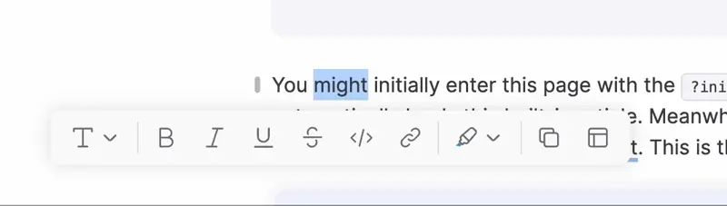
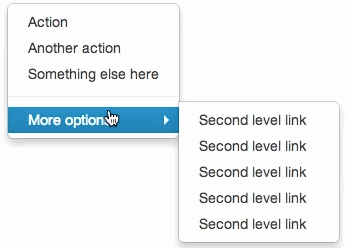
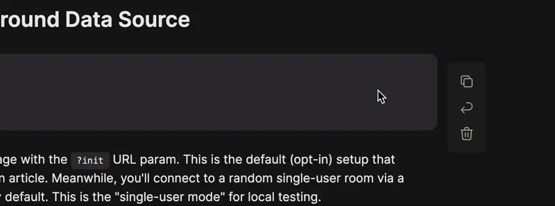
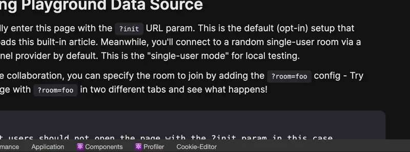

## 起因

在日常的前端开发中，悬浮展示是一个非常常见的场景，比如下拉菜单、提示框和弹出菜单等。如果你是第一次实现这些功能，可能会写出如下代码：

```ts
// DO NOT USE THIS CODE

referenceElement.addEventListener("mouseenter", () => {
  // show content
});
referenceElement.addEventListener("mouseleave", () => {
  // hide content
});
```

这段代码看起来很简单，用于显示 tooltip 是没有问题的。然而，在下拉菜单这种需要交互的场景中，当用户从主菜单移动鼠标到子菜单时，子菜单会迅速消失。

为了避免这个问题，我们可以将子菜单的 DOM 放在主菜单内部，这样鼠标移出到子菜单上时，就不再会触发 `mouseleave` 事件了。



怎么还是不行？原来设计师为了美观，在主菜单和子菜单之间留了一点空白，导致鼠标还未到达子菜单上时就触发了 `mouseleave` 事件。

## 延迟

我们可以加一点延迟，这样用户移动鼠标时，悬浮菜单不会立刻消失。顺便，有了延迟之后我们就可以把悬浮元素以 portal 的方式挂载到 body 上，可以一劳永逸地解决 `z-index` 问题。当然记得要给悬浮元素也绑定鼠标事件。

```ts
const DELAY = 300;
const abortController = new AbortController();
let timeoutId: number | undefined;

abortController.signal.addEventListener("abort", () => {
  // hide content
});

referenceElement.addEventListener("mouseenter", () => {
  clearTimeout(timeoutId);
  // show content
});
floatingElement.addEventListener("mouseenter", () => {
  clearTimeout(timeoutId);
});

referenceElement.addEventListener("mouseleave", () => {
  clearTimeout(timeoutId);
  timeoutId = setTimeout(() => abortController.abort(), DELAY);
});
floatingElement.addEventListener("mouseleave", () => {
  clearTimeout(timeoutId);
  timeoutId = setTimeout(() => abortController.abort(), DELAY);
});
```

## 细节补充

如果你的内容展示在其他悬浮层，可能会出现刚展示时鼠标已在 `referenceElement` 内部的情况。此时用户移动鼠标并不会触发 `mouseenter` 事件。因此，我更推荐使用 `mouseover` 事件而不是 `mouseenter`。

另外，为了防止在添加事件监听器时，用户的鼠标已经在元素上，我们可以使用下面的代码判断并手动触发 hover 事件。

```ts
// see https://stackoverflow.com/questions/14795099/pure-javascript-to-check-if-something-has-hover-without-setting-on-mouseover-ou
const alreadyHover = element.matches(":hover");
if (alreadyHover && !abortController.signal.aborted) {
  // When the element is already hovered, we need to trigger the callback manually
  onHoverChange(new MouseEvent("mouseover"));
}
```

## 封装

每次使用都要写这么多代码实在太麻烦，我们可以将上述代码封装成一个函数，方便在其他地方使用。

<details>
<summary>查看代码</summary>

````ts
/**
 * Call the `whenHoverChange` callback when the element is hovered.
 *
 * After the mouse leaves the element, there is a 300ms delay by default.
 *
 * Note: The callback may be called multiple times when the mouse is hovering or hovering out.
 *
 * See also https://floating-ui.com/docs/useHover
 *
 * @example
 * ```ts
 * let hoverTooltip: HTMLElement | null = null;
 * const { setReference, setFloating } = whenHover(isHover => {
 *   if (!isHover) {
 *     hoverTooltip?.remove();
 *     return;
 *   }
 *   const hoverTooltip = document.createElement('div');
 *   document.body.append(hoverTooltip);
 *   setFloating(hoverTooltip);
 * }, { hoverDelay: 500 });
 *
 * const referenceElement = document.querySelector('.reference');
 * setReference(referenceElement);
 * ```
 */
function whenHover(
  whenHoverChange: (isHover: boolean, event?: Event) => void,
  { leaveDelay = 300, alwayRunWhenNoFloating = true }: WhenHoverOptions = {},
) {
  /**
   * The event listener will be removed when the signal is aborted.
   */
  const abortController = new AbortController();
  let hoverState = false;
  let hoverTimeout = 0;
  let referenceElement: Element | undefined;
  let floatingElement: Element | undefined;

  const onHover = (e: Event) => {
    clearTimeout(hoverTimeout);
    if (!hoverState) {
      hoverState = true;
      whenHoverChange(true, e);
      return;
    }
    // Already hovered
    if (
      alwayRunWhenNoFloating &&
      (!floatingElement || !floatingElement.isConnected)
    ) {
      // But the floating element is not ready
      // so we need to run the callback still
      whenHoverChange(true, e);
    }
  };

  const onHoverLeave = (e: Event) => {
    clearTimeout(hoverTimeout);
    hoverTimeout = window.setTimeout(() => {
      hoverState = false;
      whenHoverChange(false, e);
    }, leaveDelay);
  };

  const addHoverListener = (element?: Element) => {
    if (!element) return;
    // see https://stackoverflow.com/questions/14795099/pure-javascript-to-check-if-something-has-hover-without-setting-on-mouseover-ou
    const alreadyHover = element.matches(":hover");
    if (alreadyHover && !abortController.signal.aborted) {
      // When the element is already hovered, we need to trigger the callback manually
      onHover(new MouseEvent("mouseover"));
    }
    element.addEventListener("mouseover", onHover, {
      signal: abortController.signal,
    });
    element.addEventListener("mouseleave", onHoverLeave, {
      signal: abortController.signal,
    });
  };
  const removeHoverListener = (element?: Element) => {
    if (!element) return;
    element.removeEventListener("mouseover", onHover);
    element.removeEventListener("mouseleave", onHoverLeave);
  };

  const setReference = (element?: Element) => {
    // Clean previous listeners
    removeHoverListener(referenceElement);
    addHoverListener(element);
    referenceElement = element;
  };

  const setFloating = (element?: Element) => {
    // Clean previous listeners
    removeHoverListener(floatingElement);
    addHoverListener(element);
    floatingElement = element;
  };

  return {
    setReference,
    setFloating,
    dispose: () => {
      abortController.abort();
    },
  };
}
````

</details>

## 进阶

上面的实现已经可以解决大部分问题了。如果你想要更好的用户体验，就会注意到在嵌套菜单的场景，用户很容易不小心移出菜单区域，导致菜单关闭。



### 解决方案

#### 1. Safe Bridge

当悬浮菜单和其关联区域之间存在一小片空白时，我们可以创建一个虚拟的安全区域。这样，即便鼠标悬停在两片区域中间，依然会被判定为悬浮在菜单上。



#### 2. Safe Triangles

这个方案与 Safe Bridge 类似，只是在悬浮菜单和关联区域之间创建一个安全三角形区域。当鼠标悬停在这个三角形区域内时，也会判定为悬浮在菜单上。



## 最终实现

上述两种方案都需要计算悬浮元素和参考元素的位置，以及安全区域的大小。完整实现相对复杂，感兴趣的朋友可以参考以下链接查看完整代码。

[hover - toeverything/blocksuite](https://github.com/toeverything/blocksuite/tree/95e3069189fcf2bb4e5f8a734bb306aa08fbab7e/packages/affine/components/src/hover)

另外，如果你正在使用 React 开发，Floating UI 已经封装了这些场景。你可以直接使用这个成熟的解决方案 [useHover - Floating UI](https://floating-ui.com/docs/useHover) 来处理悬停问题。

## References

- [feat(page): safe triangle for whenHover API - blocksuite](https://github.com/toeverything/blocksuite/pull/4965)
- https://www.smashingmagazine.com/2023/08/better-context-menus-safe-triangles/
- https://floating-ui.com/docs/usehover#safepolygon
- https://github.com/shoelace-style/shoelace/pull/1600
- [Breaking down Amazon's mega dropdown](https://bjk5.com/post/44698559168/breaking-down-amazons-mega-dropdown/amp)
- [a couple of pieces of glass sitting on top of a table - unsplash](https://unsplash.com/photos/a-couple-of-pieces-of-glass-sitting-on-top-of-a-table-wxvz-g1nM_k)
