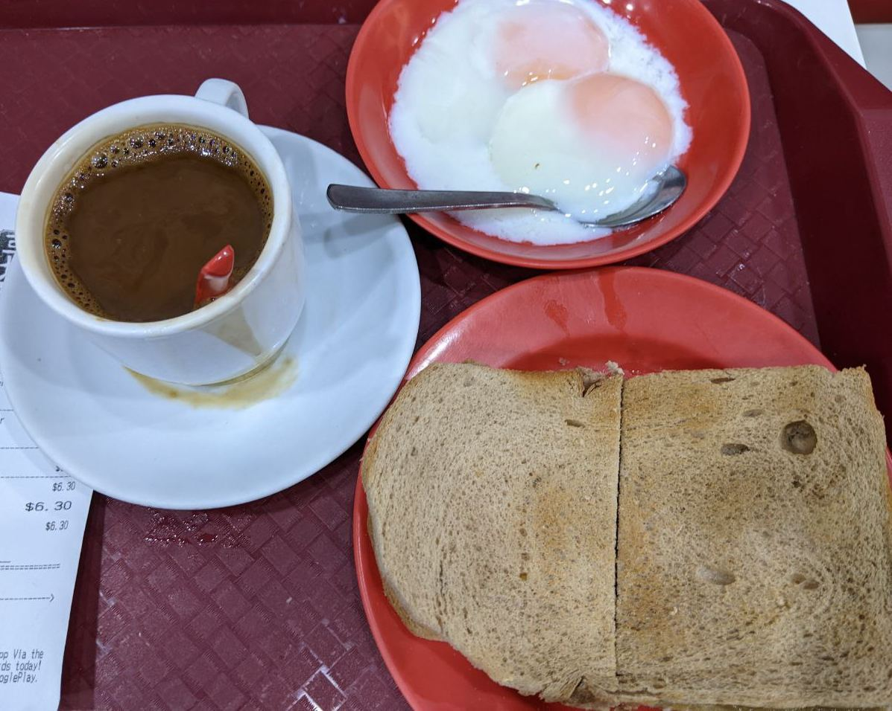
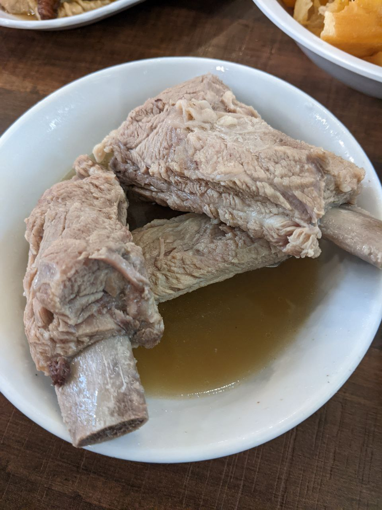
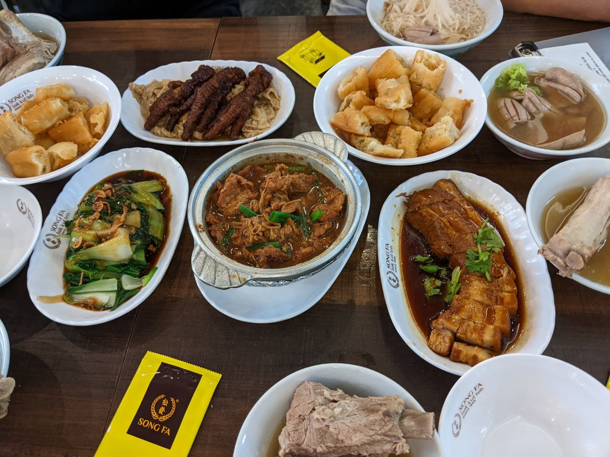
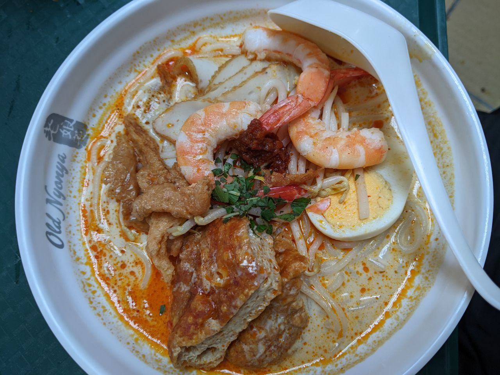
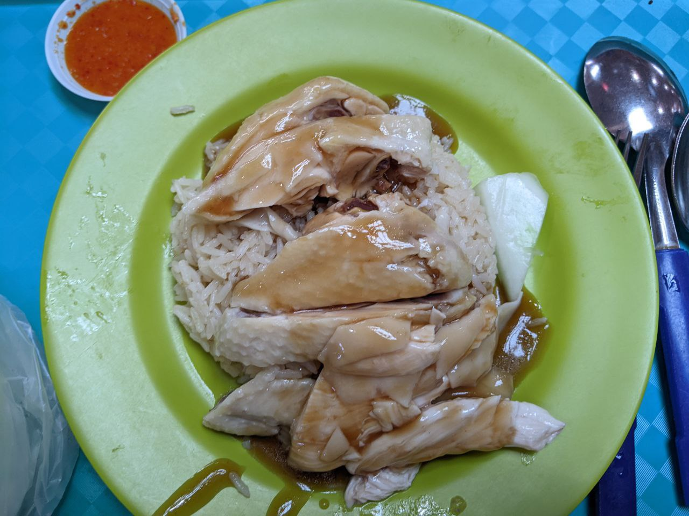
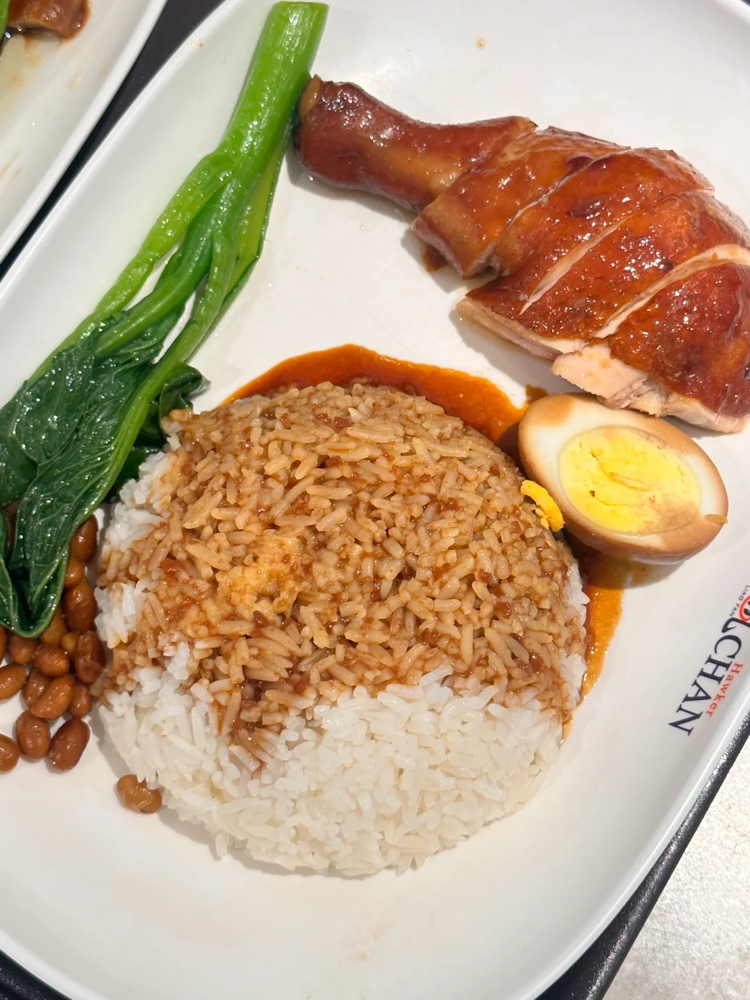
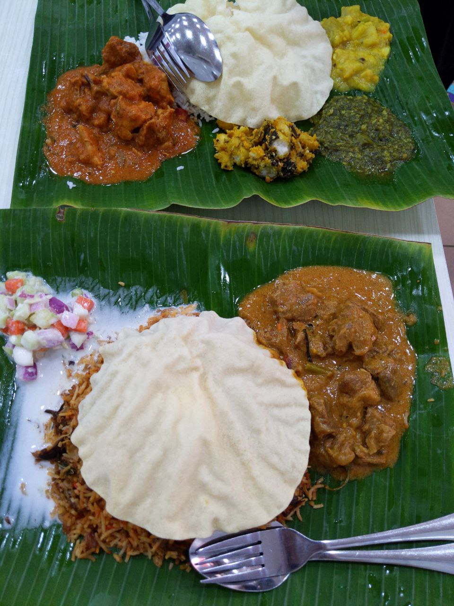
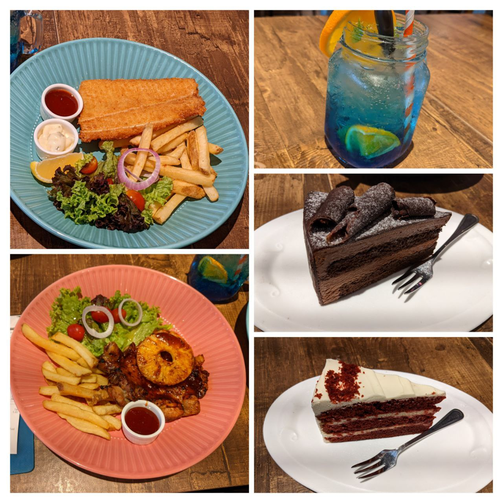
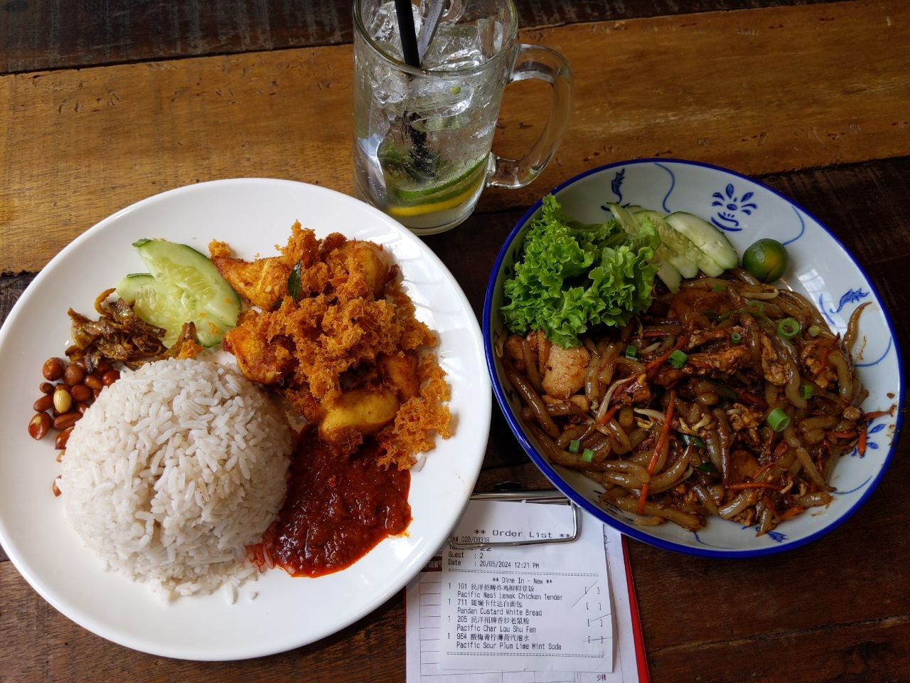

这次的新加坡之行吃到了非常多的美食，而且一次都没有踩雷！因此记录一下吃过的美食，还混了一点马来西亚的。哦对了新加坡的餐馆不提供纸巾，所以请自己备足（直接在包里塞一包一百抽的

# Ya Kun Kaya Toast

亚坤咖椰吐司，最经典的新加坡老字号早餐，全坡到处都是。在这次近一周的旅途中，我一共吃了三顿，足以证明它的好吃。

蛋的吃法是咖椰吐司蘸着蛋液吃，一开始还不是很习惯吃这么生的蛋，总之相信发达国家的卫生吧。

下图最经典的咖椰黄油吐司+咖啡+温泉蛋套餐一共 S$6.3（大约 33RMB）

## Song Fa Bak Kut Teh

大名鼎鼎的松发肉骨茶，在新加坡也有大量的连锁店，而且随时都排着长队。下图这碗经典的排骨肉骨茶一共 S$8.8（约47RMB），肉的熟度刚刚好，汤里加了胡椒，稍微有一点点咸，服务员会不断过来加汤，所以可以猛猛喝。

他家的菜品并没有那种惊艳的好吃，但是找不出缺点，所以值得一试。哦新加坡的长米完全不粘，口感很差，这个感觉是通病，就不算在松发的头上了。

五人吃到饱，人均 S$25（约 133RMB）。另外，油条也是可以蘸着肉骨汤吃的，然后中间两盘肉好吃（一盘是扣肉另一盘忘了），鸡爪比较普通

## Old Nyonya

在牛车水的 maxwell 熟食中心，只要 S$7（约 37RMB）。第一次尝试叻沙选了微辣，这个咖喱的汤底配上微甜的椰香太棒了。有点像国内的沙茶面的汤底那种感觉，但味道完全不一样。顶上加的豆制品之类的浇头味道也是完全没吃过的口感。总之非常推荐大家尝试叻沙。

地址：1 Kadayanallur St, #01-04 Maxwell Food Centre, Singapore 069184

## Tian Tian Hainanese Chicken Rice

还是在 maxwell 熟食中心的天天海南鸡饭，米饭是好吃的米饭，配上酱汁很好吃，但整体并不特别，不值得排那么长的队。下面这份白斩鸡 S$6（约 32RMB）。

## Hawker Chan

了凡油鸡饭，新加坡比较有名的米其林小店。米饭上的酱很独特，面的口感也很特别，一般的好吃。豉油鸡饭、叉烧饭一共 S$20（约107RMB）

## Shanthee's Curry Restaurant

在新加坡小印度尝鲜的应该算比较正宗的印度菜，店里店员和其他顾客都是印度人。看着隔壁桌印度人点了一份咖喱然后把咖喱倒进饭里，然后用手！把米饭和咖喱拌在一起。那一刻我就觉得来对了，然后开始默默祈祷店员一会给我们餐具。

总之服务员是给了餐具的（松了一口气），顶上那个馕是更像是不那么脆的薯片，边上的酱汁很辣，米饭还是那种毫无口感的难吃的长米。整体上吃的不习惯，没有吃完但是非常满意。

两人一共 S$17（约 90RMB）

地址：13 Veerasamy Rd, Singapore 207321

## Vivo Pizza Paradigm Mall JB

马来西亚新山的西餐店，虽然是披萨招牌但是我们并没有吃披萨。各个菜都很不错，尤其是这瓶饮料，颜值太高了，甜品还巨大，而且两人竟然只吃了 MYR99.5（约 153RMB）

地址：Paradigm Mall JB, 4F-45A, Skudai Hwy, Taman Bukit Mewah, 81200 Johor Bahru, Johor, Malaysia

# Pacific Kopi Jalan Dhoby 民洋茶室

在马来西亚新山的陈旭年文化街。左边是椰浆饭，右边是老鼠粉，一共 MYR38.5（约 60RMB）。椰浆饭是难吃的米，而且椰浆味很淡，老鼠粉挺好吃。

地址：11, Jalan Dhoby, Bandar Johor Bahru, 80000 Johor Bahru, Johor, Malaysia

## Mr. coconut

是家到处都有的椰子水店，椰子味浓厚且清新，而且底下还有椰子碎。
