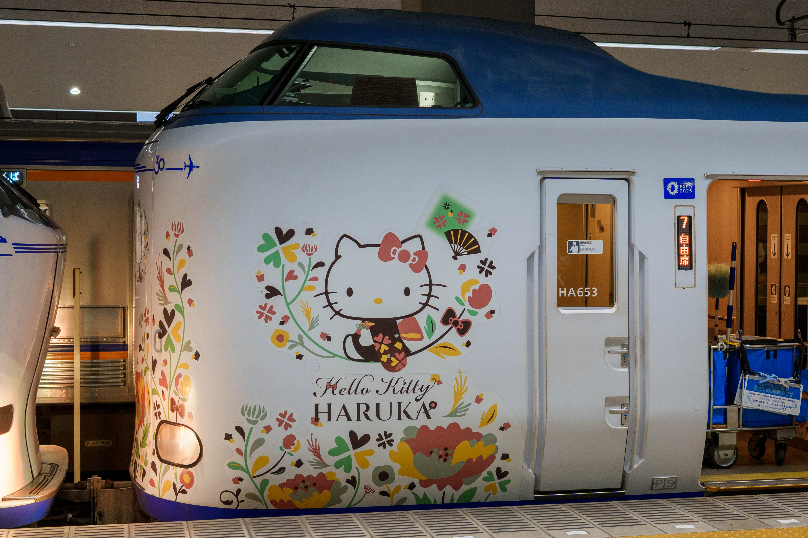
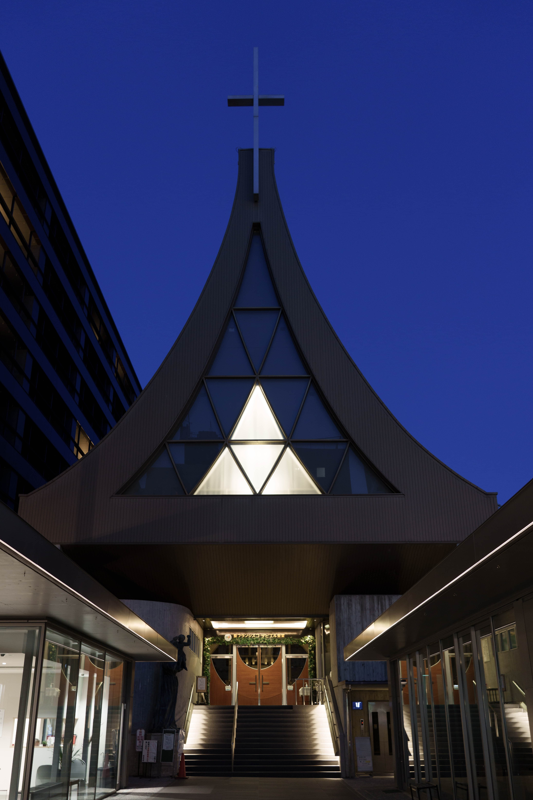
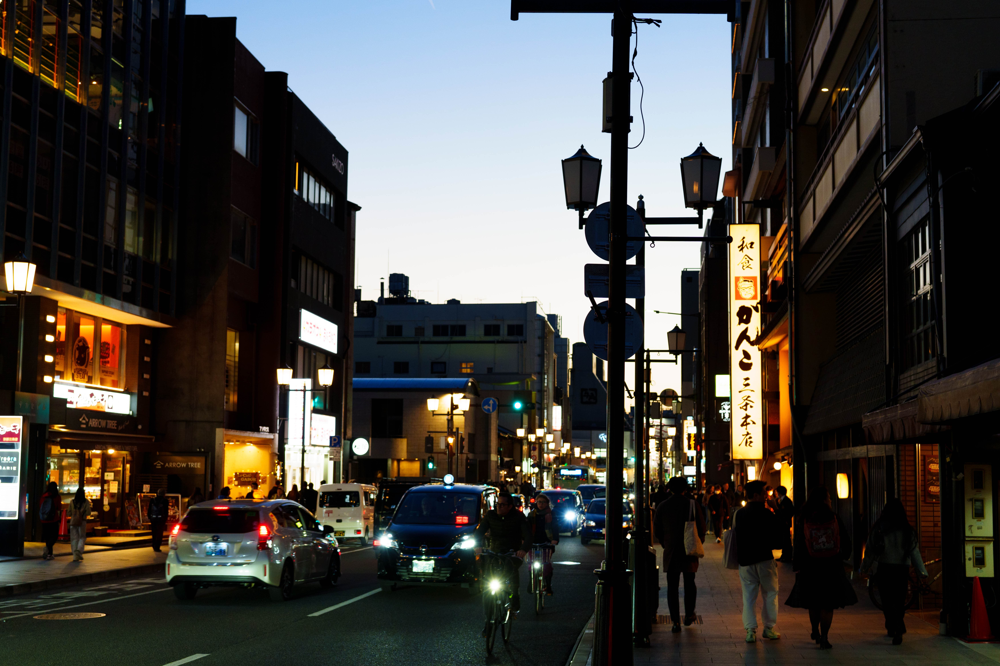
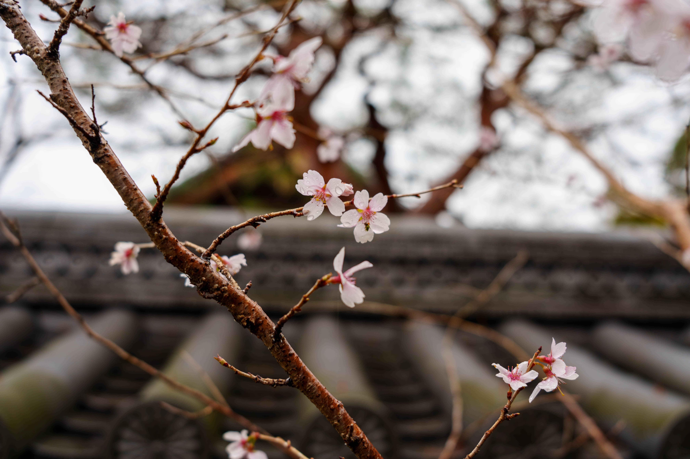
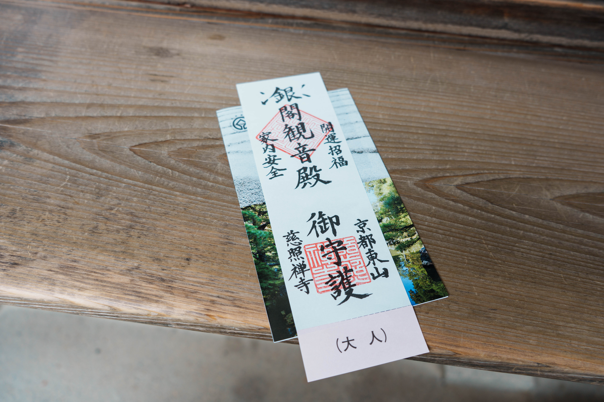
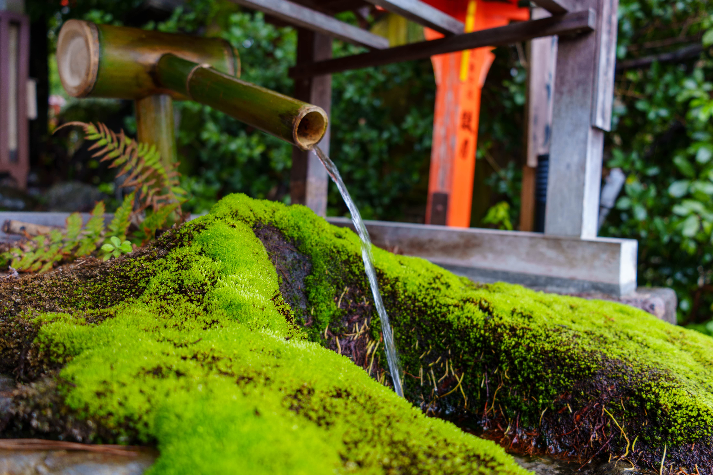
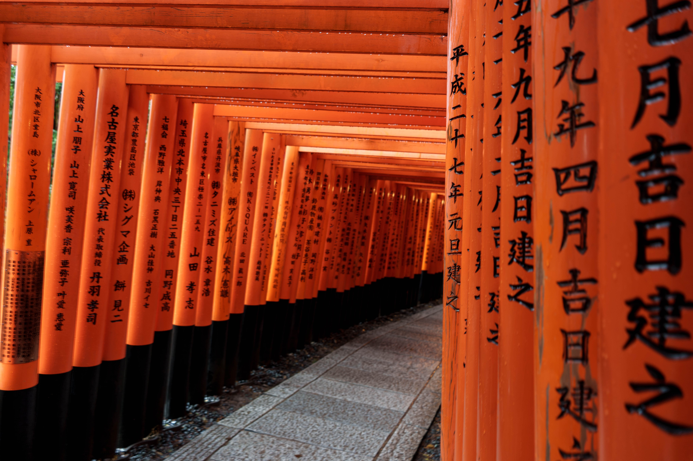
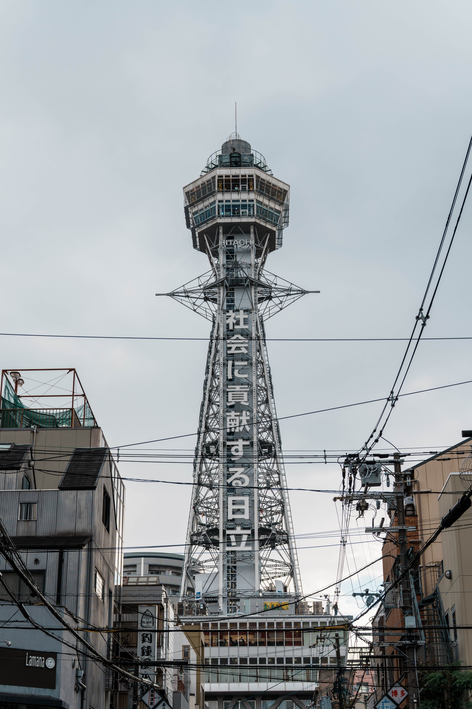

临时起意买了周末飞往大阪的机票，再请上前后两天假就是一次简单的出游。

## Day 1

主要的行程放在了京都，所以落地大阪之后直接搭乘 Haruka 去京都。

在酒店登记入住之后在酒店租了自行车到鸭川边骑行，鸭川虽然平平无奇但总是有很多人，大家都很惬意地沿着河边约会散步。天色渐渐暗下来了，趁着蓝调在路上拍了好看的教堂。

最后在 Google Maps 推荐的一个小店吃了非常鲜的清汤拉面。

非常简单的一天，虽然没有什么特别的行程，但在京都的街道上骑行，感受着宁静的氛围，已经是非常美好的体验了。

## Day 2

第二天计划去南禅寺，永观堂，哲学之道，银阁寺，鸭川三角洲。

早上起来先去了南禅寺，路边的樱花树都还没开，所以只是看起来很大的寺庙。再往后走到永观堂，这里本来是以红叶闻名的，但现在是早春只有一些花树开了。院子打理得很好，有一种苏州园林的感觉。

里面很大的区域是需要拖鞋光脚参观的，体验很新奇，还遇到了类似鱼洗的共振金属碗，一个外国人玩了好久，我试了好几次都没成功。

出来之后冒着小雨走哲学之道，一路上的树都比较秃，人也不多。沿着哲学之道一路前行，到达银阁寺参观。

银阁寺的门票是一张很有特色的御守。

参观结束后在银阁寺附近的店里吃了点甜品顺带休息。然后后乘公交车去鸭川三角洲，巡礼了玉子爱情故事和京吹，再去下鸭神社时神社正好关门了，只好拍了点照回去。

这天住的酒店在非常繁华的四条河原町，附近非常热闹，对面就是高岛屋隔壁也有小吃集市。晚饭挑了一家和牛盖饭，但并不喜欢，和牛吃不出入口即化，调味不调太淡，蘸盐和酱油又太咸，也没有其他配菜，基本就和牛和米饭，而且贵。

## Day 3

逛了高岛屋的任天堂店和鸢屋书屋，抽了塞尔达里的左纳乌扭蛋。顺便还喝了中村藤吉的抹茶，到店之后店员就会给你一壶泡着喝的好喝抹茶。我点了一杯薄茶，分量不多，单喝有点苦，配吃的羊羹单吃太甜，两个一起吃才正好。

下午走经典京都路线，从四条河原町出发，路过鸭川走到祗园白川，路过八坂神社，二年坂三年坂，再到清水寺结束。今天天气依然很差，全程下着雨，顺着人流一路走，想起了上一次来日本的记忆，这次去清水寺，买了票进去参观，里面并没有什么特别的。

今晚酒店在清水五条，服务员态度很好，甚至送我上电梯之后一直在门口鞠躬着搞得我很不好意思，上去休息一小会之后，看着时间才四点多，临时增加去伏见稻荷大社的计划。因为比较迟，在千本鸟居的人比较少，找路人拍到了和鸟居的合照。

回去之后很晚了，在四条附近赶在闭店前五分钟吃上了麺屋猪一的拉面，面汤依然很鲜而且是很周五那家不一样的鲜。

## Day 4

最后一天坐京阪电车到大阪逛大阪城。逛了一圈本来想进去，看着时间不太够就放弃了。接着搭观光车坐地铁去看了通天阁，通天阁一样没有上去，拍了点照之后走路从日本桥逛到难波。

在日本桥爽逛骏河屋 和 Anime，最后一顿在难波吃了好吃的 Kusaka Curry。吃完正好赶上前往机场的南海快线，关西的 T2 超级小，一眼望到头，想买的牛奶和柠檬啤酒都没看到有人卖，只好随便买了点抹茶小饼干。

