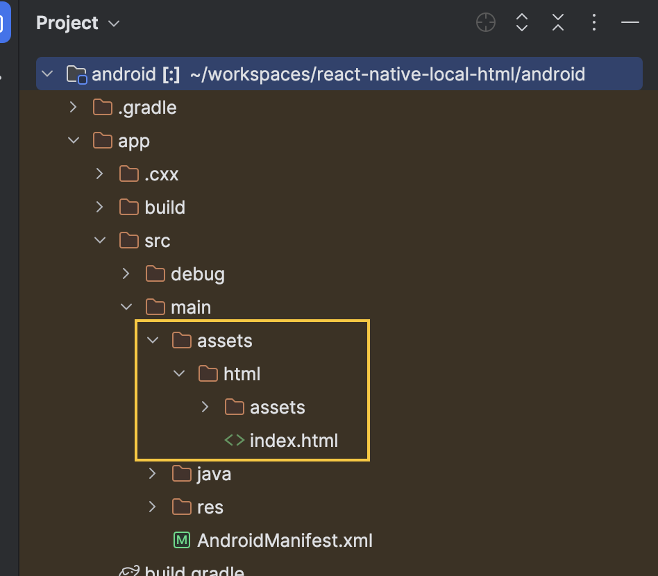
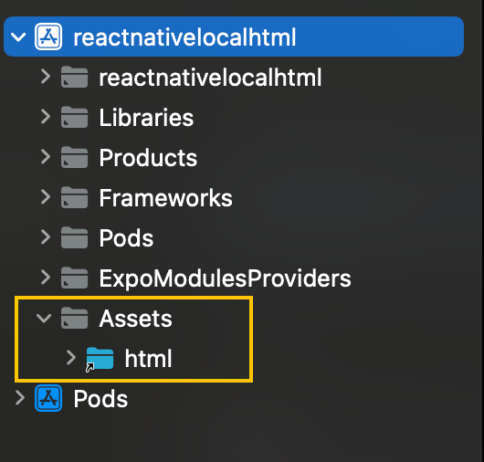
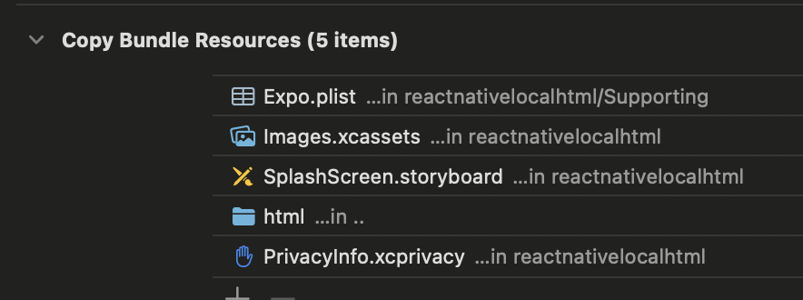

## Intro

如果让你用最快速的方式把一个 Web 应用改成手机应用，你会怎么做？我想很多人都会选择在应用中加载 WebView 组件展示 HTML 内容，也就是“套壳”。市场上也有不少工具帮助你实现这个方案（如 [Capacitor JS](https://capacitorjs.com/)）。

不过，我们最终选择了 React Native。这主要是为了兼顾开发效率与用户体验：我们希望可以在后续开发中渐进地切换到原生组件。最开始直接复用 Web 端代码快速出原型，后续将核心交互部分逐步替换成 RN 原生实现；而像文章详情页这种富文本展示场景，则依然可以保留 WebView 方案。Folo 就是这样做的，快速验证了原型，并且已经逐步迁移到了 RN 实现。

## Challenges

既然决定加载本地文件，我们面临三个主要难题：

1.  **资源打包**：如何把 HTML、CSS、JS、图片等静态资源正确地打包进 iOS 和 Android 的 App 包（Bundle）中？
2.  **路径引用**：WebView 应该加载什么 URI？iOS 和 Android 的文件系统路径完全不同。
3.  **相对路径**：本地 HTML 文件中引用的 `./script.js` 或 `./style.css` 能否正常加载？

## Solution

经过一番折腾，总结出了一套基于 Expo 的可行方案。

### 1. 资源拷贝 (Asset Copying)

我们首先要做的是把打包好的 Web 资源打包到原生项目中。然而，React Native 默认的打包流程不会自动把项目里的 `html` 文件夹当作原生资源打包进去，我们需要介入打包流程。

起初，我尝试寻找现有的社区插件，但发现它们通常会把文件“拍平”复制，导致 HTML 中的相对路径引用失效。于是我向 `expo-custom-assets` 提了一个 [Issue](https://github.com/Malaa-tech/expo-custom-assets/issues/10)，希望支持保留目录结构 (`preserveFolder`)。

在等待官方支持期间，我参考了它的实现，修改了一个 Config Plugin 来处理资源的拷贝。这个插件会在 Expo 在预构建阶段将文件复制到原生项目的资源目录中。

- **Android**: 目标路径是 `android/app/src/main/assets/`
- **iOS**: 目标路径是 `Assets/` (添加到 App Bundle 中)

最初的插件实现如下：

```js
const {
  withDangerousMod,
  withXcodeProject,
  IOSConfig,
} = require("@expo/config-plugins");
const fs = require("node:fs");
const path = require("node:path");

const isAssetReady = (assetsPath) => {
  return fs.existsSync(assetsPath);
};

const withAssets = (config, props) => {
  if (!isAssetReady(props.assetsPath)) {
    throw new Error(
      `Assets source directory not found! path: ${props.assetsPath}`
    );
  }
  const configAfterAndroid = addAndroidResources(config, props);
  const configAfterIos = addIOSResources(configAfterAndroid, props);
  return configAfterIos;
};

// Code inspired by https://github.com/rive-app/rive-react-native/issues/185#issuecomment-1593396573
function addAndroidResources(config, { assetsPath }) {
  return withDangerousMod(config, [
    "android",
    async (config) => {
      // Get the path to the Android project directory
      const { projectRoot } = config.modRequest;

      // Get the path to the Android resources directory
      const resDir = path.join(projectRoot, "android", "app", "src", "main");

      // Create the 'assets' directory if it doesn't exist
      const rawDir = path.join(resDir, "assets");
      fs.mkdirSync(rawDir, { recursive: true });

      // Move asset file to the resources 'raw' directory
      const assetsBaseName = path.basename(assetsPath);
      const targetDir = path.join(rawDir, assetsBaseName);
      fs.mkdirSync(targetDir, { recursive: true });
      fs.cpSync(assetsPath, targetDir, { recursive: true });

      // Access the resources directory by using `file:///android_asset/FILENAME`
      return config;
    },
  ]);
}

// Code inspired by https://github.com/expo/expo/blob/61f8cf8d4b3cf5f8bf61f346476ebdb4aff40545/packages/expo-font/plugin/src/withFontsIos.ts
function addIOSResources(config, { assetsPath }) {
  return withXcodeProject(config, async (config) => {
    const IOS_GROUP_NAME = "Assets";
    const project = config.modResults;
    const { platformProjectRoot } = config.modRequest;

    // Create Assets group in project
    IOSConfig.XcodeUtils.ensureGroupRecursively(project, IOS_GROUP_NAME);

    // Add assets to group
    addIOSResourceFile(project, platformProjectRoot, [assetsPath]);

    return config;
  });

  function addIOSResourceFile(project, platformRoot, assetFilesPaths) {
    for (const assetFile of assetFilesPaths) {
      const filePath = path.relative(platformRoot, assetFile);
      IOSConfig.XcodeUtils.addResourceFileToGroup({
        filepath: filePath,
        groupName: IOS_GROUP_NAME,
        project,
        isBuildFile: true,
        verbose: true,
      });
    }
  }
}

module.exports = withAssets;
```

半年之后，`expo-custom-assets` 支持了这个特性，我便将项目迁移到了这个插件上面，配置变得非常简单：

```typescript
// app.config.ts
const config = {
  plugins: [
    [
      // https://github.com/Malaa-tech/expo-custom-assets
      "expo-custom-assets",
      {
        assetsPaths: ["./html"], // 你的本地 html 目录
        preserveFolder: true, // 保留目录结构
      },
    ],
  ],
};
```

:::note
注意：由于这个插件是在 **Prebuild** 阶段执行的（即生成原生代码时），所以每次修改了配置或者添加/删除了资源文件后，都需要重新运行 `npx expo prebuild` 来更新原生项目中的资源文件。
:::

配置完成后，我们可以检查一下原生项目目录，确认文件是否被正确拷贝：

- **Android**: 检查 `android/app/src/main/assets/html/`
- **iOS**: 检查 Xcode 项目中的 `Assets` 组，或者构建产物 `.app` 包内的 `html` 文件夹。


_(图示：Android Studio 中看到的 assets 目录结构)_



_(图示：Xcode 中看到的 Assets 组结构)_

### 2. 确定加载路径 (Platform-Specific URIs)

文件打包进去了，接下来就是告诉 WebView 去哪里找。

- **Android**: Android 有一个特殊的协议 `file:///android_asset/` 可以直接访问 assets 目录下的文件。
- **iOS**: iOS 的文件在 Bundle 根目录下，通常可以直接通过文件名访问。

代码实现：

```tsx
import { Platform } from "react-native";
import { WebView } from "react-native-webview";

const htmlUrl = Platform.select({
  ios: "html/index.html", // iOS 会在 Bundle 根目录下寻找
  android: "file:///android_asset/html/index.html", // Android 的特殊 asset 路径
  default: "",
});

export default function LocalHtmlViewer() {
  return (
    <WebView
      source={{ uri: htmlUrl }}
      originWhitelist={["*"]} // 允许加载本地文件
    />
  );
}
```

### 3. 调试技巧 (Debugging)

在实际开发中，最让人头疼的问题往往是“白屏”。如果路径配置错误，WebView 可能不会抛出明显的错误，而是直接显示一片空白。这时候就需要用到 WebView 的调试功能了。

React Native WebView 提供了 `webviewDebuggingEnabled` 属性，开启后可以使用 Safari (iOS) 或 Chrome (Android) 的开发者工具来调试 WebView 中的内容，就像调试普通网页一样。

```tsx
<WebView
  source={{ uri: htmlUrl }}
  originWhitelist={["*"]}
  webviewDebuggingEnabled={__DEV__} // 开启调试
/>
```

通过调试工具，我们可以清楚地看到网络请求（Network）和控制台日志（Console），从而快速定位资源加载失败的原因。

## Alternative Solutions

在调研过程中，也看到过其他几种方案：

1.  **Bundler 打包**：使用 Bundler 将 HTML、CSS、JS 全部打包成一个巨大的 HTML 字符串，然后通过 `source={{ html: '...' }}` 加载。这对于简单的小页面很简单，但对于稍微复杂一点的 Web 项目，维护成本极高，且调试困难。
2.  **本地静态服务**：在 React Native 内部启动一个静态文件服务器（如 `react-native-static-server`），然后 WebView 加载 `http://localhost:port/index.html`。这个方案引入了额外的依赖和复杂性，显然不是我想要的。

相比之下，直接加载本地文件（file:// 协议）显得简单而轻量，虽然配置稍微麻烦一点，但一劳永逸。

## Outro

借助这套方案，我们在 Folo 移动端的开发初期，成功复用了大量 Web 端现有的代码，以极低的成本快速构建并验证了产品原型。如果你正面临将 Web 应用快速迁移到移动端的挑战，这套“本地 HTML + WebView”的方案绝对值得一试。

为了方便大家上手，我整理了一个包含完整配置细节的示例仓库，欢迎查阅：[react-native-local-html](https://github.com/lawvs/react-native-local-html)。希望这篇文章能帮你少走弯路！

## References

- [react-native-local-html - GitHub](https://github.com/lawvs/react-native-local-html)
- [Folo - GitHub](https://github.com/RSSNext/Folo)
- [Loading Local HTML Files - React Native WebView Guide](https://github.com/react-native-webview/react-native-webview/blob/master/docs/Guide.md#loading-local-html-files)
- [Debugging WebView Contents - React Native WebView Guide](https://github.com/react-native-webview/react-native-webview/blob/master/docs/Debugging.md)
- [expo-custom-assets - GitHub](https://github.com/Malaa-tech/expo-custom-assets)
