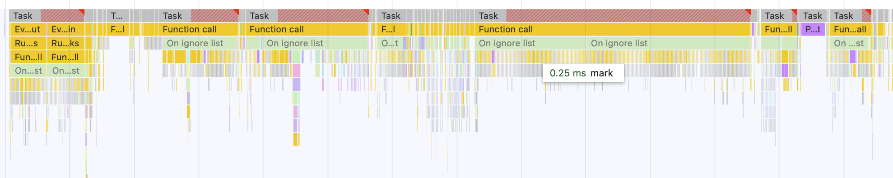
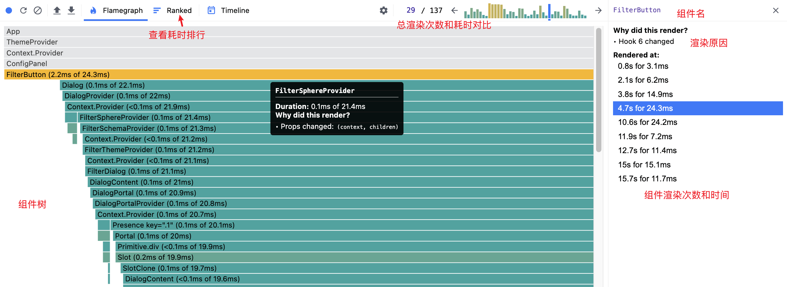
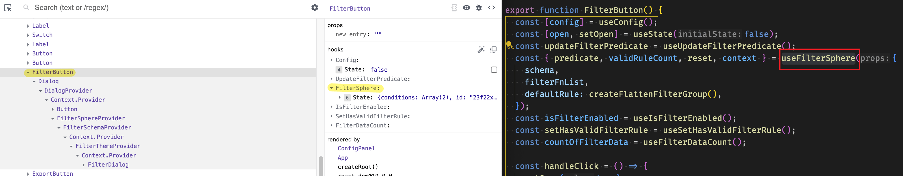

React 是一个非常流行的前端框架，但是在使用 React 过程中，我们可能会遇到一些性能问题，比如页面卡顿、动画掉帧等问题。那么当我们遇到这些性能问题时，应该如何排查呢？本文将介绍一些常见的排查方法。

在普通的 JavaScript 应用中，我们通常使用 Chrome DevTools 的 Performance 面板来分析性能问题。但在 React 应用中，由于 React 的内部实现机制，火焰图中会出现大量 React 内部函数调用，这使得我们难以直观地定位到具体问题。



React 应用在 Performance 面板中的火焰图下十分细碎。因此，我们需要一些专门的工具来帮助我们分析 React 应用的性能问题。

## React DevTools - 官方性能分析利器

React DevTools 包含了官方提供的性能分析工具，它可以记录详细渲染信息，帮助我们快速定位性能问题。



React DevTools 记录的火焰图就清晰地展示了每个组件的渲染时间和原因。我们还可以切换到排序视图，快速定位到性能瓶颈组件。

不过，React DevTools 的 Profiler 记录的组件更新的原因，只能看到变化的 hook 序号，如上图仅标识了 `Hook 6 changed`，如果想要知道具体的 hook 是哪个，还需要切换到 Components 面板手动查找。



以上图为例，我们可以在 Components 面板中找到对应的组件，然后查看该组件的 hook 信息就能知道 hook 6 其实是`useFilterSphere`。

## Why Did You Render - 详细的重渲染分析

[why-did-you-render](https://github.com/welldone-software/why-did-you-render) 是一个非常强大的工具，它可以在控制台中详细记录组件重渲染的原因并且提供组件 props 和 state 的变化详情。

由于全部开启会在控制台刷屏，所以更推荐在找到具体问题后针对部分组件启用分析冲渲染原因。


```js
// wdyr.ts
/// <reference types="@welldone-software/why-did-you-render" />
import React from "react";

if (process.env.NODE_ENV === "development") {
  const whyDidYouRender = require("@welldone-software/why-did-you-render");
  whyDidYouRender(React, {
    trackAllPureComponents: true,
  });
}

// 你也可以选择在需要时追踪特定的组件
// BigListPureComponent.whyDidYouRender = true
```

## React Scan - 可视化重渲染检测

[react-scan](https://github.com/aidenybai/react-scan) 是2024 年新出现的一个轻量级工具，主要用于可视化检测组件的重渲染情况。


相比于 React DevTools 自带的 highlight 功能，react-scan 展示了更多的信息，包括组件的名称、更新次数，还能在选择组件之后展示更新的 props。

React Scan 更适合在开发阶段一直开启，帮助我们及早发现潜在的性能问题。配置非常简单，只需要在开发环境中引入即可，甚至还有 CDN 的脚本能够直接引入

```ts
if (import.meta.env.DEV) {
  const { scan } = await import("react-scan");
  scan({ enabled: true, log: true, showToolbar: true });
}
```

## Million Lint - 带有编辑器集成的实验性工具

[Million Lint](https://million.dev/docs) 和 React Scan 是同一个团队出品的，集成了一个实验性的编辑器扩展，在开发阶段就能随时发现应用中多次渲染的组件。

但是由于这个 VSCode 扩展性能实在太差了，所以我最后还是把它关掉了。（一个性能优化工具本身性能不好，多么讽刺）

## ESLint - 静态代码检查

解决性能问题的最好方法是预防性能问题的发生。使用合理且严格的规则并且充分理解 React 的工作机制，是避免性能问题的最好方法。

以下是一份和 React 性能相关的严格 ESLint 规则，感谢 [Garfield550](https://github.com/Garfield550)的配置示例

<details>
<summary>点击查看</summary>

```ts
export default [
  {
    files: ["**/*.?([cm])[jt]s?(x)"],
    rules: {
      // eslint-plugin-react-hooks
      // https://github.com/facebook/react/tree/main/packages/eslint-plugin-react-hooks
      "react-hooks/rules-of-hooks": "error",
      "react-hooks/exhaustive-deps": "error",

      // eslint-plugin-react-compiler
      // https://github.com/facebook/react/tree/main/compiler/packages/eslint-plugin-react-compiler
      // "react-compiler/react-compiler": reactCompiler ? "error" : "off",

      // eslint-plugin-react-refresh
      // https://github.com/ArnaudBarre/eslint-plugin-react-refresh
      "react-refresh/only-export-components": "warn",

      // @eslint-react/eslint-plugin
      // https://github.com/Rel1cx/eslint-react/tree/main/packages/plugins/eslint-plugin
      "@eslint-react/ensure-forward-ref-using-ref": "error",
      "@eslint-react/jsx-no-duplicate-props": "error",
      "@eslint-react/no-children-count": "error",
      "@eslint-react/no-children-for-each": "error",
      "@eslint-react/no-children-only": "error",
      "@eslint-react/no-children-to-array": "error",
      "@eslint-react/no-clone-element": "error",
      "@eslint-react/no-comment-textnodes": "error",
      "@eslint-react/no-implicit-key": "error",
      "@eslint-react/no-missing-component-display-name": "error",
      "@eslint-react/no-unstable-context-value": "error",
      "@eslint-react/dom/no-children-in-void-dom-elements": "error",

      "@eslint-react/web-api/no-leaked-interval": "error",
      "@eslint-react/web-api/no-leaked-resize-observer": "error",
      "@eslint-react/web-api/no-leaked-timeout": "error",
      "@eslint-react/hooks-extra/no-unnecessary-use-memo": "error",
      "@eslint-react/hooks-extra/no-direct-set-state-in-use-effect": "error",
      "@eslint-react/hooks-extra/no-direct-set-state-in-use-layout-effect":
        "error",
    },
  },
];
```

</details>

## 小结

选择合适的工具组合可以帮助我们更好地发现和解决 React 应用中的性能问题。建议在开发过程中，将这些工具作为日常开发工具链的一部分，以便及早发现和解决性能问题。
